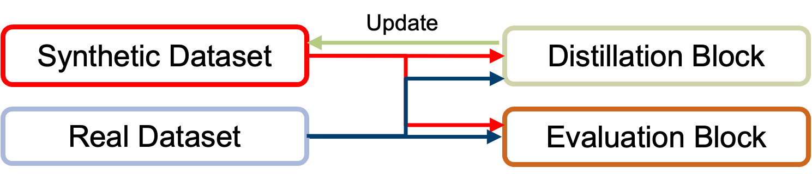
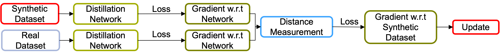

# Dataset Distillation on 3D Point Clouds using Gradient Matching

Figure 1: Overview of the main pipeline


Figure 2: Pipeline of the Distillation Block

[Report](assets/Report.pdf)

## Abstract
As the demand for better deep learning model increases, the need for larger datasets is on the rise. This increase in size is requiring more resources to be able to store such datasets and use them in training. Dataset distillation is a relatively new research focus that attempts to condense a large dataset by learning a smaller synthetic dataset which when used to train a neural network reaches a similar performance as using the original dataset. Several approaches attempt distilling dense data representations such as images whether by using a bi-level optimization method, feature matching, or gradient matching. However, the objective of this paper is to use dataset distillation using gradient matching on a sparse data representation, specifically 3D point clouds with a variable number of input points. Instead of turning on or off voxels in a dense grid, the objective is updating the point coordinates directly starting from points scattered randomly in 3D space to eventually converge to capture the geometric features of the classes. Even though the results do not reach other state of the art approaches, they show a proof of concept that updating coordinates directly is a possible method for distilling data.

## Getting Started
### 1. Installing MinkowskiEngine
This implementation focuses on sparse tensors. MinkowskiEngine is heavily used in the process.
Follow the steps found [here](https://github.com/NVIDIA/MinkowskiEngine) to install MinkowskiEngine

### 2. Installing the dependancies
- Install Conda on your system
- Install the environment
```
conda env create -f environment.yml
```

### 3. Update configuration
Update `configs/default.ini` important fields:

- `logging_parent` stands for the destination of your logging files
- `distillation_checkpoint_dir` stands for the destination of your checkpoint saves

### 3. Running the Distillation
```
python mnist_distill.py
```

Useful parameters:

- `--no-log` when debugging this prevents creating tensorboard logs
- `--exp <NAME>` quickly set the experiment name for each run
- `--pytorch` uses pytorch architecture instead of Minkowski Engine. (DEFAULT: FALSE)
